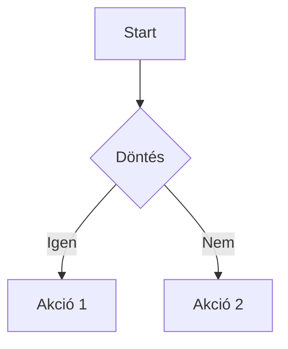
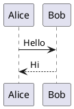

# Markdown language útmutató (VS Code + markdownlint + Markdown Preview Enhanced)

## 1. Tartalomjegyzék

- [2. Visual Studio Code](#2-visual-studio-code)
  - [2.1. VS Code telepítése](#21-vs-code-telepítése)
  - [2.2. Kiegészítők telepítése](#22-kiegészítők-telepítése)
  - [2.3. Hasznos billentyűparancsok](#23-hasznos-billentyűparancsok)
- [3. Mi az a Markdown?](#3-mi-az-a-markdown)
- [4. Fejlécek](#4-fejlécek)
- [5. Bekezdések és sortörések](#5-bekezdések-és-sortörések)
- [6. Kiemelések](#6-kiemelések)
- [7. Listák](#7-listák)
- [8. Hivatkozások](#8-hivatkozások)
- [9. Képek](#9-képek)
- [10. Kód](#10-kód)
- [11. Idézetek](#11-idézetek)
- [12. Táblázatok](#12-táblázatok)
- [13. Feladatlisták](#13-feladatlisták)
- [14. Elválasztó vonalak](#14-elválasztó-vonalak)
- [15. HTML beágyazás](#15-html-beágyazás)
- [16. Láblécezet (Footnotes)](#16-láblécezet-footnotes)
- [17. Matematikai képletek (MPE)](#17-matematikai-képletek-mpe)
- [18. Diagramok (Mermaid, PlantUML) (MPE)](#18-diagramok-mermaid-plantuml-mpe)
- [19. YAML front matter](#19-yaml-front-matter)
- [20. Markdownlint: minőség és szabályok](#20-markdownlint-minőség-és-szabályok)
- [21. Gyakorlati mintadokumentum-sablon](#21-gyakorlati-mintadokumentum-sablon)

---

## 2. Visual Studio Code

### 2.1. VS Code telepítése

**Windows**
1. Töltsd le a Visual Studio Code-ot a hivatalos oldalról.
2. Futtasd a telepítőt (`.exe`).
3. Ajánlott opciók telepítés közben:
   - „Add to PATH”
   - „Open with Code” (jobb klikk menü integráció)
   - „Register Code as an editor for supported file types”

**macOS**
1. Töltsd le a `.zip` csomagot.
2. Húzd a VS Code-ot az **Applications** mappába.
3. (Opcionális) Parancssori indítás: a VS Code-ban `Cmd+Shift+P` → írd be: `Shell Command: Install 'code' command in PATH`.

**Linux**
- Disztribúciótól függően `.deb`, `.rpm`, vagy Snap/Flatpak telepítés is elérhető.
- Általános tipp: használd a disztribúciód csomagkezelőjét, így frissíteni is könnyebb lesz.

### 2.2. Kiegészítők telepítése

A dokumentumhoz a következő VS Code kiegészítőket használd:

1. **markdownlint**  
   - Extension neve tipikusan: **markdownlint** (publisher: David Anson)
   - Feladat: stílus- és szabálysértések jelzése (pl. hiányzó üres sorok, rossz felsorolás, túl hosszú sorok).

2. **Markdown Preview Enhanced (MPE)**  
   - Extension neve: **Markdown Preview Enhanced**
   - Feladat: fejlettebb előnézet (diagramok, képletek, export lehetőségek, stb.).

**Telepítés lépései**
1. VS Code-ban nyisd meg az Extensions nézetet:
   - `Ctrl+Shift+X` (Windows/Linux)
   - `Cmd+Shift+X` (macOS)
2. Keresd meg: `markdownlint` → **Install**
3. Keresd meg: `Markdown Preview Enhanced` → **Install**
4. (Ajánlott) Indítsd újra a VS Code-ot.

**Előnézet használata**
- Beépített Markdown Preview:
  - `Ctrl+Shift+V` / `Cmd+Shift+V`
- Oldalsó (split) előnézet:
  - `Ctrl+K` majd `V` / `Cmd+K` majd `V`
- MPE előnézet:
  - `Ctrl+Shift+P` / `Cmd+Shift+P` → keresd: **Markdown Preview Enhanced: Open Preview**

### 2.3. Hasznos billentyűparancsok

- Parancspaletta: `Ctrl+Shift+P` / `Cmd+Shift+P`
- Fájl keresés: `Ctrl+P` / `Cmd+P`
- Oldalsó előnézet megnyitása: `Ctrl+K` majd `V` / `Cmd+K` majd `V`
- Komment ki/be: `Ctrl+/` / `Cmd+/`
- Sor mozgatása fel/le: `Alt+Up/Down` / `Option+Up/Down`
- Több kurzor: `Alt+Click` / `Option+Click`
- Formázás (ha van formatter): `Shift+Alt+F` / `Shift+Option+F`

---

## 3. Mi az a Markdown?

A **Markdown** egy könnyen olvasható, szöveg-alapú jelölőnyelv, amivel gyorsan lehet strukturált dokumentumokat írni (címek, listák, kód, linkek). A `.md` fájlokat rengeteg eszköz támogatja (GitHub, GitLab, VS Code, dokumentáció-generátorok).

---

## 4. Fejlécek

A fejlécek `#` jelekkel készülnek. Minél több a `#`, annál kisebb a fejléc szintje.

```md
# H1 cím
## H2 cím
### H3 cím
#### H4 cím
```

**Tipp (markdownlint):**
- Általában dokumentumonként **egy** `#` (H1) ajánlott.

---

## 5. Bekezdések és sortörések

Bekezdéshez hagyj **egy üres sort** a blokkok között.

```md
Ez az első bekezdés.

Ez a második bekezdés.
```

Kényszerített sortörés:
- Ha sortörés kell ugyanabban a bekezdésben: a sor végére tegyél **két szóközt**, majd Enter.

```md
Első sor.··
Második sor ugyanabban a bekezdésben.
```

---

## 6. Kiemelések

- **Félkövér**: `**szöveg**`
- *Dőlt*: `*szöveg*`
- ***Félkövér + dőlt***: `***szöveg***`
- Áthúzott (GitHub-flavor): `~~szöveg~~`

```md
**félkövér**, *dőlt*, ~~áthúzott~~
```

---

## 7. Listák

### 7.1. Számozatlan lista

```md
- Elem 1
- Elem 2
  - Al-elem 2.1
  - Al-elem 2.2
- Elem 3
```

### 7.2. Számozott lista

```md
1. Első
2. Második
3. Harmadik
```

**Tipp:** Markdownban gyakran így is működik:

```md
1. Első
1. Második
1. Harmadik
```

### 7.3. Vegyes lista és bekezdés

A bekezdést a listán belül **behúzással** tartsd az elem alatt.

```md
- Elem név

  Elem részletes leírása (ugyanahhoz a listaponthoz).
```

---

## 8. Hivatkozások

### 8.1. Inline link

```md
[OpenAI](https://openai.com)
```

### 8.2. Referencia link

```md
[OpenAI][openai]

[openai]: https://openai.com
```

### 8.3. Belső hivatkozások (ugrás a dokumentumban)

Fejezetekre így hivatkozz:

```md
Lásd: [Táblázatok](#12-táblázatok)
```

**Megjegyzés:** az anchor generálása renderelőnként eltérhet. VS Code/MPE többnyire jól kezeli az automatikus anchorokat, de más platformokon lehet különbség.

---

## 9. Képek

### 9.1. Kép beillesztése

```md

```

### 9.2. Kattintható kép (kép linkként)

```md
[](https://példa.hu)
```

---

## 10. Kód

### 10.1. Inline kód

```md
Használd a `git status` parancsot.
```

### 10.2. Kódblokk (fenced code block)

Három backtickkel:

```md
```python
def hello():
    print("hello")
```
```

> Megjegyzés: itt a dokumentáció miatt „kód a kódban” szerepel. Valódi fájlban a belső backtickeket egyszer használod.

### 10.3. Nyelv megadása

A backtickek után add meg a nyelvet (szintaxis kiemelés miatt), pl.: `python`, `js`, `json`, `bash`, `yaml`.

---

## 11. Idézetek

```md
> Ez egy idézet.
>
> Több bekezdés is lehet idézetben.
```

---

## 12. Táblázatok

```md
| Név   | Szint | Megjegyzés |
|------|------:|------------|
| Anna |     3 | Stabil     |
| Béla |     1 | Kezdő      |
```

---

## 13. Feladatlisták

```md
- [x] Kész
- [ ] Nincs kész
```

---

## 14. Elválasztó vonalak

```md
---
```

---

## 15. HTML beágyazás

```md
<div style="padding: 8px; border: 1px solid #ccc;">
  HTML doboz
</div>
```

---

## 16. Láblécezet (Footnotes)

```md
Ez egy állítás lábjegyzettel.[^1]

[^1]: Itt a lábjegyzet szövege.
```

---

## 17. Matematikai képletek (MPE)

Inline:

```md
A Pitagorasz-tétel: $a^2 + b^2 = c^2$.
```

Blokk:

```md
$$
\int_0^1 x^2 \, dx = \frac{1}{3}
$$
```

---

## 18. Diagramok (Mermaid, PlantUML) (MPE)

Mermaid flowchart:

```md

```

PlantUML (ha be van állítva):

```md

```

---

## 19. YAML front matter

```md
---
title: "Dokumentum címe"
date: 2026-02-11
tags:
  - markdown
  - docs
---
```

---

## 20. Markdownlint: minőség és szabályok

### 20.1. Tipikus hibák

- Hiányzó üres sor fejlécek/listák körül
- Rossz behúzás listákban
- Túl hosszú sorok (ha be van kapcsolva)
- Rossz header-szintek (pl. H1 után H3)

### 20.2. Projekt szintű konfiguráció

`.markdownlint.json` példa:

```json
{
  "default": true,
  "MD013": { "line_length": 120, "code_blocks": false, "tables": false },
  "MD033": false
}
```

### 20.3. VS Code beállítás tipp

`settings.json` példa:

```json
{
  "editor.wordWrap": "on",
  "markdownlint.config": {
    "MD013": { "line_length": 120, "code_blocks": false, "tables": false }
  }
}
```

---

## 21. Gyakorlati mintadokumentum-sablon

```md
# Projekt dokumentáció

## Tartalom
- [Bevezetés](#bevezetés)
- [Telepítés](#telepítés)
- [Használat](#használat)
- [Hibaelhárítás](#hibaelhárítás)

## Bevezetés
Rövid leírás a projektről.

## Telepítés
1. Követelmények
2. Lépések

## Használat
- Példák
- Konfiguráció

## Hibaelhárítás
- Gyakori hibák
- Megoldások
```

---

### Rövid ellenőrzőlista (praktikus)

- [ ] Van H1 cím a tetején
- [ ] Van tartalomjegyzék belső linkekkel
- [ ] Fejezetek között van üres sor
- [ ] Kódok fenced code blockban vannak nyelvvel
- [ ] Listák behúzása konzisztens
- [ ] A markdownlint nem jelez kritikus hibát
